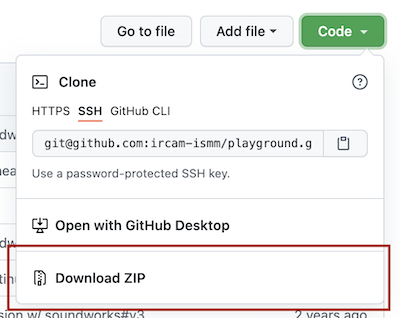

# `playground`

## Install

1. Install NodeJS (LTS version), download [https://nodejs.org/en/](https://nodejs.org/en/) and follow instructions
2. Download the application

if you are a `git` user

```
cd /some/where/you/like
git clone https://github.com/ircam-ismm/playground.git playground
```

if not
  - download the source code at [https://github.com/ircam-ismm/playground](https://github.com/ircam-ismm/playground)



  - unszip the directory
  - open a Terminal and write `cd `(with a space at the end) then drop the application directory into the terminal
  - you should see something like `cd /User/youname/whatever/path/to/playground`
  - press Enter
  
3. Install the application and launch

In the terminal, type the following command (press `Enter` after each line)

```
cd /User/name/whatever/path/to/playground
npm install
npm run build
npm run start
```

The server should be running after the last command

You can now access the application through your favorite browser (which should not be Safari)

4. Stop the server

press `Ctrl + c` into the Terminal which runs the server

5. Restart the application 

to restart the application only the following commands are needed

```
cd /User/name/whatever/path/to/playground
npm run start
```

## Making sound
1. Launch the server
In the terminal, type the following command (press `Enter` after each line)
```
cd /User/name/whatever/path/to/playground
npm run start
```

2. Launch a client
A client where the sound will be heard.
To access a client, type `http://127.0.0.1:8000` into your favorite browser, then press `please clic to join`.
TIP: to emulate severals client in 1 browser, type `http://127.0.0.1:8000/?emulate=10`

3. Launch the main controller
To ear sound in the client, you have to access the controller.
The main controller is the command board of playground.
To launch the controller, in ANOTHER brower windows type `http://127.0.0.1:8000/controller`

4. Choose a controller
From the controller you can now access different synths (trigger-controller, soloist-controller, etc.). 

5. Trigger it! 
From trigger-controller, just press the soundbank you want (crickets, floating, footsteps) and press trigger all.

## Max/Live integration
there is a way to "wireless" control playgrounds synths into Max or Ableton Live.

1. Download the lastest release of `soundworkds-max` here : https://github.com/collective-soundworks/soundworks-max/releases

2. Unzip the package and copy the resulting directory in `~/Documents/Max 8/Packages`

3. Go to `playground/max` and launch one of the patch

4. Here you go !

For Ableton Live integration, just open the `playground/Max For Live Devices` folder, open Live and drag-and-drop one of the `.amxd` file into an audio track. For now you can automatise parameters like everything else in Ableton Live.

Note : there is no sounds in Live, all devices are just a 'telecommand' to control the playground synths. The sound is still outputted into clients.


## Creating a new project

In the `projects` directory, copy and paste an exisiting directory and rename it.

To select a given projet update the entry `project` in the `config/application.json` so that it matches the name of the directory that contains your project.

The file `project/my-project/config.json` allows to configure the name of the project, the name of the author, and some interface elements such as if audience members are asks to register their position in the room or not.


## Credits

The `playground` application have been developed in collaboration with Garth Paine ([http://www.activatedspace.com/](http://www.activatedspace.com/)) during his Ircam's Articistic Research Residency in 2017-18.

The audio files provided in the `default` project of the application have been created and thankfully shared by Garth Paine.

## License

BSD-3-Clause
